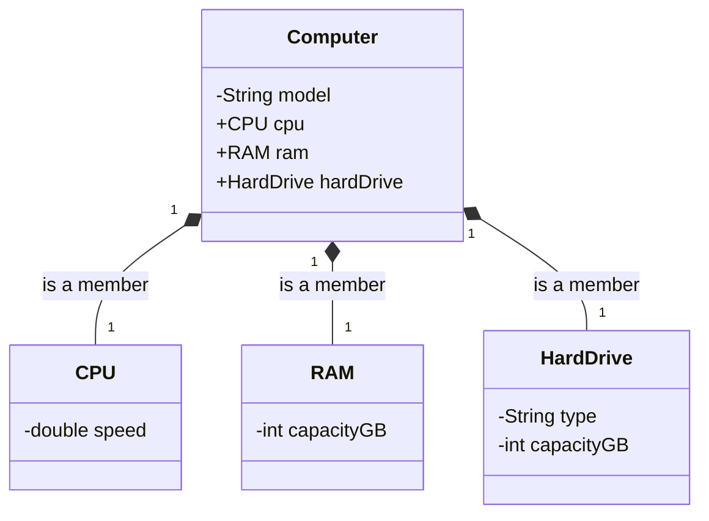

## Exercise 4: Computer Composition

- Model the main parts that compose a computer. A computer has a model. A computer is composed of a CPU, RAM, and a hard drive. Once these parts are assembled into a particular computer, they logically belong to that computer. Each part has its own characteristics (e.g., CPU: speed, Memory: capacity, Hard drive: type and capacity).

- Expected Functionality:

  - Represent the characteristics of a computer.

  - Represent the characteristics of a CPU.

  - Represent the characteristics of a RAM module.

  - Represent the characteristics of a Hard Drive.

  - Model the relationship where a computer is composed of a CPU, a RAM module, and a Hard Drive. Decide whether this relationship is Composition or Aggregation and justify your choice.

  - Allow for the creation of a computer by assembling it with specific instances of a CPU, RAM, and Hard Drive.

  - Allow for displaying the complete configuration of the computer (details of each of its parts).

  - (Optional) Implement a powerOn() method in the computer that might call methods of its parts.